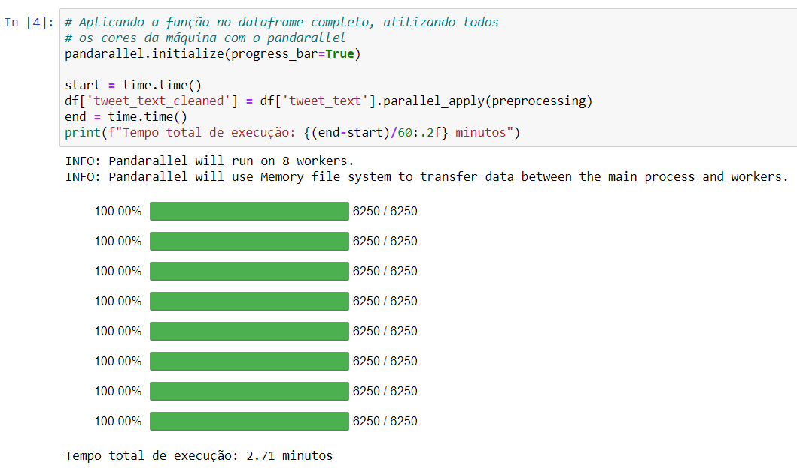
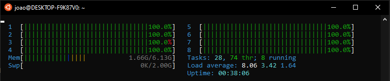

# Parallel Pandas Apply Processing with Pandarallel

## Notebook Output


## All Processors Cores Being Used


## References

1. https://towardsdatascience.com/pandaral-lel-a-simple-and-efficient-tool-to-parallelize-your-pandas-operations-on-all-your-cpus-bb5ff2a409ae
2. https://github.com/nalepae/pandarallel
3. https://spacy.io/

## Setup

```
$ python -m venv venv
$ pip install -r requirements.txt
$ python -m spacy download pt_core_news_sm
```